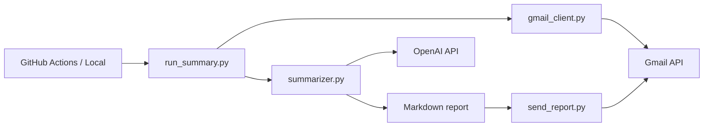

# Email Assistant

A personal Gmail automation agent that reads your **Primary** inbox, summarizes messages with OpenAI, and emails you a structured daily report. Designed for weekday check-ins without auto-replying to anyone.

---

## Overview

This project connects three services:

| Component | Role |
|-----------|------|
| **Gmail API** | Fetches recent Primary inbox messages (read + send report to yourself) |
| **OpenAI API** | Classifies and summarizes email content |
| **GitHub Actions** | Runs the pipeline on a schedule (weekdays) or on demand |

The agent does **not** send replies to other people or create Gmail drafts automatically. It only **reads** your inbox and **sends one summary email to you**.

---

## Features

- **Primary inbox only** — ignores Promotions, Social, and other Gmail tabs
- **Time-windowed runs** — each scheduled run looks at mail since the previous check (not the full inbox every time)
- **Structured reports** (morning / midday):
  - **Reply needed** — messages where you were personally addressed (e.g. greetings with your name) and a reply is likely expected
  - **Financial** — real payments, receipts, paychecks, and bank alerts (not marketing or ads)
  - **Other emails** — everything else (FYI, newsletters, notifications)
- **Evening recap** — short end-of-day summary without full section headings
- **Budget-friendly defaults** — `gpt-4o-mini`, capped body length, and `max_tokens` limits
- **Runs locally or in the cloud** — same Python code on your machine or via GitHub Actions

---

## How It Works



1. Fetch Primary messages matching a Gmail search query (time window depends on run mode).
2. Build a prompt with subject, sender, and body snippets (plus automatic payment hints for financial detection).
3. OpenAI returns a classified summary.
4. The summary is emailed to you via Gmail API.

---

## Project Structure

```
email-automation/
├── auto-once.py       # One-time OAuth setup (local browser login)
├── gmail_client.py    # Gmail auth + fetch Primary emails
├── summarizer.py      # OpenAI prompts and summarization
├── send_report.py     # Send summary email to yourself
├── run_summary.py     # Main entry point (orchestrates the pipeline)
├── fetch-test.py      # Quick test: list fetched emails
├── test-gmail.py      # Simple Gmail connection test
├── requirements.txt   # Python dependencies
├── .env               # Local secrets (not committed — see .gitignore)
└── README.md

../.github/workflows/
└── email-assistant.yml   # Scheduled + manual runs (repo root)
```

---

## Implementation Steps

This section documents the build order used to implement the project.

### Step 1 — Local environment

1. Install **Python 3.11+** (3.12 recommended).
2. Create the `email-automation` folder and a virtual environment:

   ```bash
   python -m venv .venv
   source .venv/bin/activate        # macOS/Linux
   .\.venv\Scripts\Activate.ps1     # Windows
   pip install --upgrade pip
   ```

3. Add a `.gitignore` so secrets and local artifacts are never committed (`.env`, `token.json`, `credentials.json`, `.venv/`, etc.).

### Step 2 — Google Cloud and Gmail API

1. Create a project in [Google Cloud Console](https://console.cloud.google.com/).
2. Enable the **Gmail API**.
3. Configure the **OAuth consent screen** (External, Testing mode is fine for personal use).
4. Add yourself as a **Test user** on the consent screen.
5. Create **OAuth 2.0 Client ID** credentials (type: **Desktop app**).
6. Download the client JSON and save it as `credentials.json` in this folder (gitignored).

### Step 3 — Gmail authorization (one time)

1. Install dependencies: `pip install -r requirements.txt`
2. Run `python auto-once.py` — a browser opens for Google sign-in.
3. Approve permissions (read inbox + send email for reports).
4. A `token.json` file is created locally (gitignored). Save the **refresh token** securely for GitHub Actions later.

**Scopes used:**

- `gmail.readonly` — read messages
- `gmail.send` — send the summary report to yourself

### Step 4 — Gmail reader module

- Implemented `gmail_client.py` with `fetch_primary_emails()` and an `EmailMessage` dataclass.
- Default query: `in:inbox category:primary` plus a time filter.
- Body text is truncated (~1000 characters) to control OpenAI cost.

### Step 5 — OpenAI summarization

- Implemented `summarizer.py` using the OpenAI Chat Completions API.
- Local configuration via `.env`:

  | Variable | Purpose |
  |----------|---------|
  | `OPENAI_API_KEY` | OpenAI API key |
  | `MY_EMAIL` | Your Gmail address (used in prompts) |
  | `OPENAI_MODEL` | Optional; defaults to `gpt-4o-mini` |

- Classification rules distinguish **Reply needed**, **Financial**, and **Other** mail.
- Regex-based **payment hints** help detect PayPal, bank alerts, paychecks, and similar messages before the model classifies them.

### Step 6 — Email the report

- Implemented `send_report.py` to send a plain-text summary to yourself via Gmail API.
- `run_summary.py` ties fetch → summarize → send (and prints the report to the terminal).

### Step 7 — Run modes and time windows

`run_summary.py` supports three modes with different Gmail time filters:

| Mode | CLI | Gmail window (approx.) | Report style |
|------|-----|------------------------|--------------|
| Morning | `morning` | Last 12 hours | Full sections |
| Midday | `midday` | Last 4 hours | Full sections |
| Evening | `evening` | Last 13 hours | Short recap |

```bash
python run_summary.py morning
python run_summary.py midday
python run_summary.py evening
python run_summary.py morning --no-email   # print only, do not send
```

### Step 8 — GitHub Actions (automation)

1. Updated `gmail_client.py` to authenticate from **environment variables** when `token.json` is not present (for CI).
2. Added workflow file at the **repository root**: `.github/workflows/email-assistant.yml`
3. Stored secrets in **GitHub → Settings → Secrets and variables → Actions** (repository secrets):

   | Secret name | Description |
   |-------------|-------------|
   | `OPENAI_API_KEY` | OpenAI API key |
   | `MY_EMAIL` | Your Gmail address |
   | `GMAIL_CLIENT_ID` | OAuth client ID from `credentials.json` |
   | `GMAIL_CLIENT_SECRET` | OAuth client secret |
   | `GMAIL_REFRESH_TOKEN` | Refresh token from `auto-once.py` |
   | `OPENAI_MODEL` | Optional model name |

4. Push code to GitHub and test with **Actions → Email Assistant → Run workflow**.

**Scheduled runs (UTC cron — adjust for your timezone):**

| Local target (US Eastern, EDT) | UTC cron | Mode |
|------------------------------|----------|------|
| ~9:00 AM Mon–Fri | `0 13 * * 1-5` | morning |
| ~1:00 PM Mon–Fri | `0 17 * * 1-5` | midday |
| ~10:00 PM Mon–Fri | `0 2 * * 2-6` | evening |

GitHub cron uses **UTC**. Use [crontab.guru](https://crontab.guru/) to convert to your timezone.

Manual runs always show as **“Manually run by …”** in the Actions UI. Scheduled runs appear with event type **schedule** — you do not need to click Run workflow each day.

---

## Prerequisites

- Python 3.11+
- Google Cloud project with Gmail API enabled
- OpenAI API account with billing enabled
- GitHub repository (for scheduled automation)

---

## Quick Start (Local)

```bash
cd email-automation
python -m venv .venv
# activate venv (see Step 1)
pip install -r requirements.txt
```

1. Place `credentials.json` in this folder (from Google Cloud).
2. Create `.env` with `OPENAI_API_KEY` and `MY_EMAIL`.
3. Run `python auto-once.py` once to create `token.json`.
4. Run `python run_summary.py morning`.

---

## Security Best Practices

- **Never commit** `.env`, `credentials.json`, `token.json`, or refresh tokens.
- Use **GitHub Actions secrets** for all credentials in CI — not hardcoded values in the workflow or Python files.
- Keep the repository **private** if it contains automation tied to your personal inbox.
- Use **read + send** scopes only as needed; the agent sends mail only to yourself.
- Revoke access anytime at [Google Account permissions](https://myaccount.google.com/permissions).
- Rotate API keys if they are ever exposed.

---

## Troubleshooting

| Issue | Likely cause | Fix |
|-------|----------------|-----|
| `403 access_denied` during OAuth | Email not on OAuth test users list | Add your account under OAuth consent screen → Test users |
| `insufficient_quota` (OpenAI) | No billing / credits | Enable billing on OpenAI platform |
| `No token.json and no GMAIL_* env vars` | Missing GitHub secrets | Add repository secrets (exact names) |
| `invalid_grant` | Expired or revoked refresh token | Re-run `auto-once.py`, update `GMAIL_REFRESH_TOKEN` secret |
| Empty workflow on GitHub | File committed before content was saved | Commit and push the full YAML again |
| Financial section empty | Model misclassification | Payment hints in `summarizer.py` improve detection; verify body text length in `gmail_client.py` |
| No email at scheduled time | Wrong UTC cron or empty inbox window | Adjust cron; check Actions log for `schedule` runs |

---

## Stopping the Agent

- **Pause automation:** GitHub → Actions → Email Assistant → **⋯** menu → **Disable workflow**
- **Remove schedule only:** Delete the `schedule:` block in `email-assistant.yml` and push
- **Revoke Gmail access:** [Google Account permissions](https://myaccount.google.com/permissions)

---

## Future Enhancements (not in v1)

- Draft reply suggestions inside the report or as Gmail drafts (`gmail.compose` scope)
- Gmail labels / auto-archive
- Failure notifications when a GitHub Action run fails
- Weekend schedule or custom timezone configuration in workflow inputs

---

## License

Personal project — use and adapt for your own inbox automation.

---

## Author

**Ehsan Faghih**

Implemented this personal email assistant as a hands-on project combining the Gmail API, OpenAI, and GitHub Actions.

- **GitHub:** [github.com/efaghih](https://github.com/efaghih)
- **Website:** [ehsanfaghih-website.web.app](https://ehsanfaghih-website.web.app/)
- **Google Scholar:** [scholar.google.com/citations?user=1xQoOFYAAAAJ](https://scholar.google.com/citations?user=1xQoOFYAAAAJ&hl=en&oi=ao)
- **LinkedIn:** [linkedin.com/in/ehsan-faghih-510650b3](https://www.linkedin.com/in/ehsan-faghih-510650b3/)

For more AI and automation projects, visit the [AI-Projects](https://github.com/efaghih/AI-Projects) repository on GitHub.
