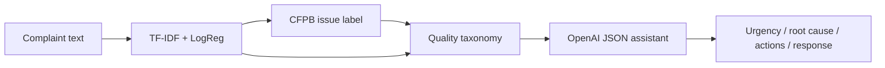
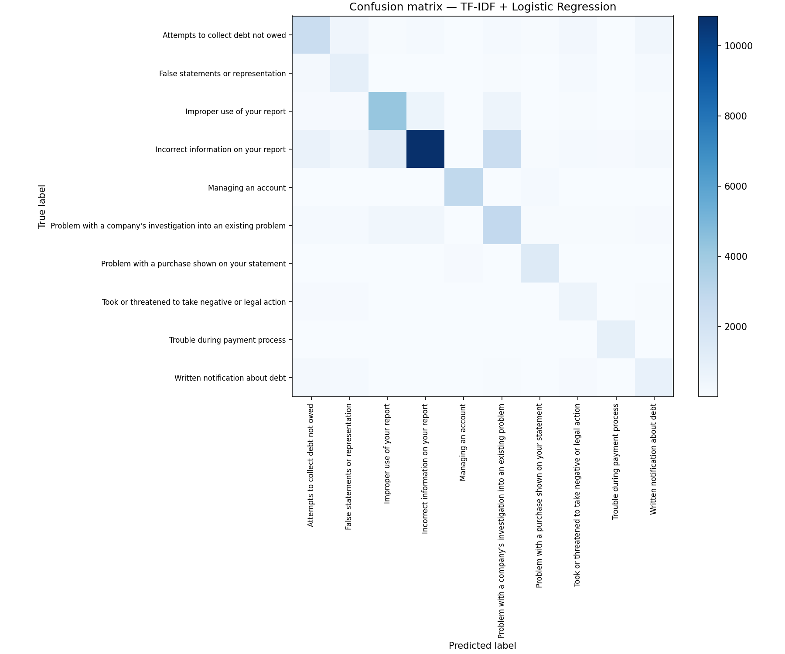
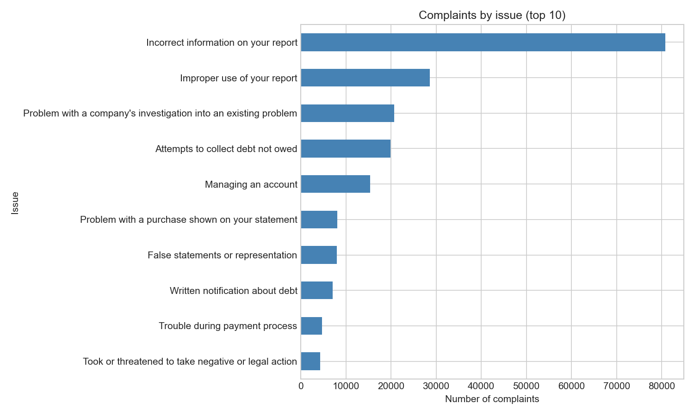
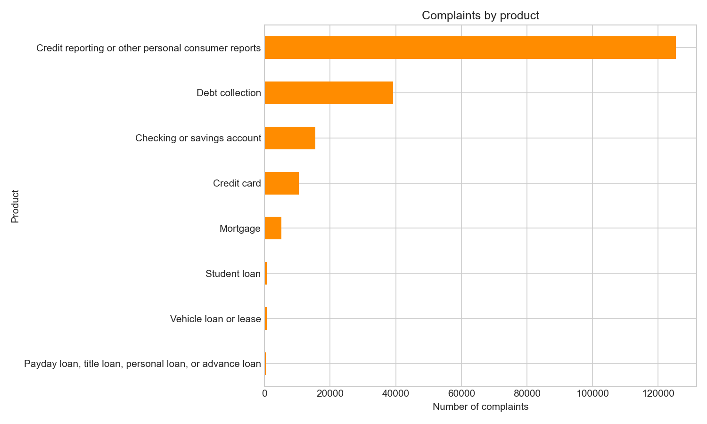
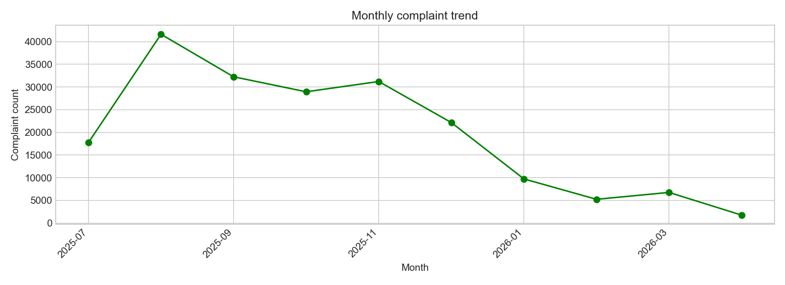
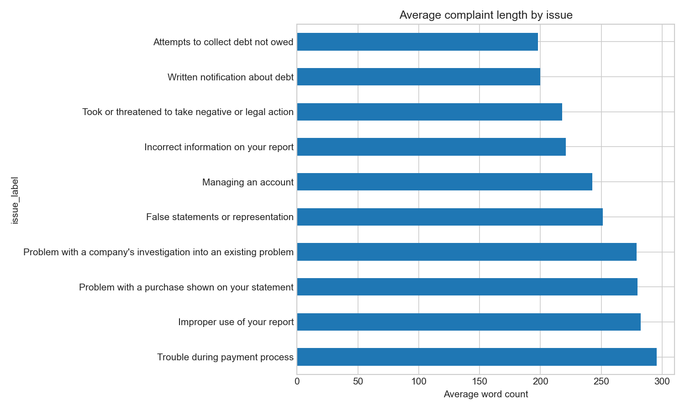
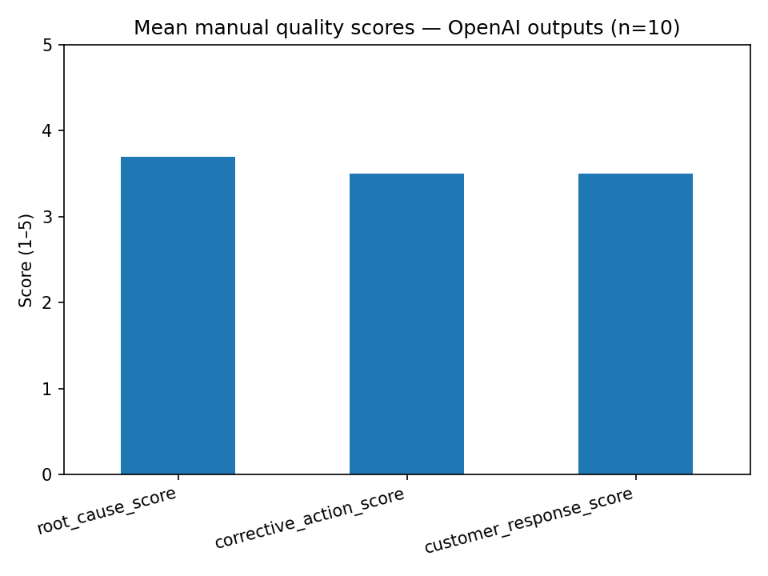

# AI Quality Complaint Classifier

An end-to-end **complaint intelligence** workflow: ingest messy consumer narratives, classify them with machine learning, map them to a general quality taxonomy (with an optional manufacturing demo layer), and use OpenAI to draft root-cause analysis, containment/corrective actions, and customer responses. I built a **Streamlit** app so anyone on a quality team can try a complaint without opening a notebook.

> **Data honesty:** This portfolio project uses the [CFPB Consumer Complaint Database](https://www.consumerfinance.gov/data-research/consumer-complaints/) (financial services), not real factory floor data. The **process**—clean → classify → taxonomy → LLM assist → evaluate → demo UI—is what transfers to manufacturing or any regulated complaint-handling environment.

---

## Purpose (STAR)

| | |
|---|---|
| **Situation** | Quality and customer-care teams receive thousands of free-text complaints. Labels are inconsistent, triage is slow, and the same issues (documentation errors, billing disputes, investigation delays) recur without structured root-cause follow-up. |
| **Task** | Design a repeatable pipeline that turns a raw complaint narrative into **category**, **urgency**, **likely root cause**, **containment/corrective actions**, and a **draft response**—with measurable baseline ML performance and a human-reviewable LLM pilot. |
| **Action** | I filtered and cleaned ~200k CFPB narratives, trained a TF-IDF + logistic regression baseline, defined a CFPB→quality→manufacturing taxonomy, chained OpenAI (`gpt-4o-mini`, JSON mode) after ML, scored a 10-case pilot, and shipped a Streamlit demo. |
| **Result** | **70.6%** issue accuracy and **0.678** macro F1 on held-out data; taxonomy maps **10** CFPB issues into **6** general quality categories; OpenAI pilot averages **3.7/5** on root cause and **3.5/5** on corrective action and customer response; interactive app for live analysis. |

---

## Why this was a problem

Complaint text arrives **unstructured**. Analysts must:

1. Read long narratives and guess the issue type.
2. Decide urgency without a shared rubric.
3. Document root cause and actions under time pressure.
4. Draft compliant customer replies case by case.

Without automation, backlogs grow, similar failures are not grouped, and lessons learned stay in individual inboxes. A classifier plus taxonomy gives **consistent labels**; an LLM layer gives **draft reasoning** that humans can edit—not replace.

---

## How this project helps fix it

| Layer | What it does |
|-------|----------------|
| **Data pipeline** | Filters to recent complaints with narratives, cleans text, and produces analysis-ready CSVs. |
| **Baseline ML** | Fast, cheap issue prediction from text alone—good enough to route work. |
| **Taxonomy** | Translates domain-specific labels (CFPB issues) into **general quality categories** and optional **manufacturing demo** labels for portfolio storytelling. |
| **OpenAI assistant** | Adds urgency, root cause, containment, corrective action, and draft response in structured JSON. |
| **Evaluation** | Manual 1–5 rubric on a pilot sample so LLM quality is visible, not assumed. |
| **Streamlit app** | One place to analyze a complaint or explore dataset charts without running notebooks. |

In production, you would swap CFPB data for internal quality logs, retrain the classifier on plant labels, and point the taxonomy at your own defect codes.

---

## Pipeline steps (what I built)

| Step | Notebook / code | Output |
|------|-----------------|--------|
| **1 — Download & filter** | `scripts/filter_v1.py` | `data/processed/cfpb_v1.csv` (~500k rows, dated narratives) |
| **2 — Inspect** | `notebooks/01_inspect_cfpb_v1.ipynb` | Schema, row counts, sample rows |
| **3 — Clean** | `notebooks/02_clean.ipynb` | `data/processed/complaints_clean.csv` (**197,471** rows, **10** issue labels) |
| **4 — EDA** | `notebooks/03_eda.ipynb` | Charts in `outputs/` |
| **5 — Baseline ML** | `notebooks/04_train_baseline.ipynb` | `models/tfidf_logreg_issue_classifier.pkl` |
| **6 — Taxonomy** | `notebooks/05_taxonomy.ipynb`, `notebooks/src/taxonomy.py` | `complaints_with_quality_category.csv` |
| **7 — OpenAI** | `notebooks/06_openai_assistant.ipynb`, `openai_analyzer.py`, `pipeline.py` | `outputs/openai_sample_10.csv` |
| **8 — Streamlit** | `app/streamlit_app.py` | Local demo UI |
| **9 — Evaluate** | `notebooks/07_evaluate.ipynb` | `outputs/openai_evaluation.csv`, score chart |
| **10 — Document** | This README | Portfolio summary |



---

## How the project works

1. **Input:** A complaint narrative (from CSV or pasted in the app).
2. **ML:** Text is lowercased; a saved **TF-IDF + logistic regression** model predicts one of **10** CFPB `issue_label` values (`class_weight=balanced`).
3. **Taxonomy:** `map_issue_to_general()` and `map_issue_to_manufacturing()` in `notebooks/src/taxonomy.py` add business-friendly labels.
4. **LLM:** `full_analysis()` in `pipeline.py` calls `analyze_complaint()` with the narrative + quality category; OpenAI returns JSON fields validated in code.
5. **Output:** A single dictionary (and Streamlit layout) with metrics, expandable ML details, action boxes, and draft response.

**Core chain:**

```text
complaint_text → ML issue → quality_category (+ manufacturing demo) → OpenAI → structured result
```

---

## Streamlit app (why I used it)

I wanted a **demo interface** that managers and recruiters could open in a browser without installing Jupyter. **Streamlit** let me build two pages quickly:

- **Analyze Complaint** — paste text, run the full pipeline, show category/urgency/actions/response.
- **Dataset Insights** — row counts, bar charts, and EDA images from `outputs/`.

The app lives in `app/streamlit_app.py`. It resolves paths from `Path(__file__).parents[1]` (project root), loads `.env` for `OPENAI_API_KEY`, and imports `full_analysis` from `notebooks/src/`.

**Run from the project root:**

```bash
python -m venv .venv
.venv\Scripts\activate          # Windows
pip install -r requirements.txt
copy .env.example .env          # add OPENAI_API_KEY
python -m streamlit run app/streamlit_app.py
```

---

## Results

### Dataset (after cleaning)

| Metric | Value |
|--------|------:|
| Complaints | 197,471 |
| Issue categories (CFPB) | 10 |
| Date range (sample) | ~2025-07 → 2026-04 |
| Avg. narrative length | ~1,400 characters (varies by issue) |

**Top CFPB issues** (share of cleaned set):

| Issue | Count | ~% |
|-------|------:|---:|
| Incorrect information on your report | 80,825 | 41% |
| Improper use of your report | 28,593 | 14% |
| Problem with a company's investigation into an existing problem | 20,741 | 11% |
| Attempts to collect debt not owed | 19,932 | 10% |
| Managing an account | 15,342 | 8% |
| Other five issues | 31,038 | 16% |

**Interpretation:** Documentation/credit-reporting issues dominate. That drives the taxonomy: most rows map to **Documentation or information issue** (~59% after mapping).

### General quality categories (after taxonomy)

| Quality category | Count | ~% |
|------------------|------:|---:|
| Documentation or information issue | 117,360 | 59% |
| Account or record error | 35,274 | 18% |
| Process delay issue | 20,741 | 11% |
| Unexpected charge or cost issue | 12,770 | 6% |
| Customer service issue | 7,055 | 4% |
| Safety or high-risk issue | 4,271 | 2% |

### Baseline classifier (TF-IDF + Logistic Regression)

| Metric | Score |
|--------|------:|
| Accuracy | **0.706** |
| Macro F1 | **0.678** |
| Weighted F1 | **0.716** |

**Interpretation:** Performance is solid for 10 imbalanced classes from noisy text. Errors often happen between related issues (e.g. debt collection vs. incorrect report)—exactly where the LLM layer adds nuance using the full narrative.



*Diagonal strength shows which issues are easiest to separate; off-diagonal blocks highlight confusions to target with more features or data in a production system.*

### Exploratory charts



*Long tail of issue types; top two reporting-related issues account for more than half of volume—useful for prioritizing playbooks.*



*Shows which financial products generate the most narratives—helps scope training data if you fine-tune per product line.*



*Volume over the filtered window; spikes may reflect seasonality or CFPB publication batches.*



*Investigation and debt issues tend to run longer—important for token limits and LLM cost planning.*

### OpenAI pilot evaluation (n = 10)

Manual rubric (1–5): root cause quality, corrective action quality, customer response quality.

| complaint_id | predicted_category | urgency | root | corrective | response |
|---:|---|---:|---:|---:|---:|
| 0 | Account or record error | Critical | 4 | 4 | 3 |
| 1 | Documentation or information issue | Critical | 3 | 3 | 3 |
| 2 | Customer service issue | Medium | 3 | 3 | 3 |
| 3 | Process delay issue | High | 4 | 4 | 4 |
| 4 | Process delay issue | High | 4 | 4 | 4 |
| 5 | Account or record error | High | 4 | 3 | 4 |
| 6 | Documentation or information issue | Medium | 3 | 3 | 3 |
| 7 | Process delay issue | High | 4 | 4 | 4 |
| 8 | Documentation or information issue | High | 4 | 3 | 3 |
| 9 | Account or record error | High | 4 | 4 | 4 |

| Dimension | Mean (1–5) |
|-----------|------------:|
| Root cause | **3.70** |
| Corrective action | **3.50** |
| Customer response | **3.50** |



**Interpretation:** Root-cause drafts scored highest—often aligned with FCRA/FDCPA-style reasoning on fraud and verification cases. Corrective actions were sometimes generic; responses occasionally kept `[Customer]` placeholders. Two cases had ML/taxonomy mismatch vs. ground truth but LLM text remained usable—good argument for **human-in-the-loop** review. A production rollout would expand the pilot (e.g. 50–100 cases) and add inter-rater agreement.

---

## Project structure

```text
quality-complaint-classifier/
├── app/
│   └── streamlit_app.py          # Demo UI
├── data/
│   ├── raw/                      # CFPB export (not in git — see .gitignore)
│   └── processed/                # Filtered & enriched CSVs
├── models/
│   └── tfidf_logreg_issue_classifier.pkl
├── notebooks/
│   ├── 01_inspect_cfpb_v1.ipynb
│   ├── 02_clean.ipynb
│   ├── 03_eda.ipynb
│   ├── 04_train_baseline.ipynb
│   ├── 05_taxonomy.ipynb
│   ├── 06_openai_assistant.ipynb
│   ├── 07_evaluate.ipynb
│   ├── requirements.txt
│   └── src/
│       ├── paths.py              # Portable PROJECT_ROOT
│       ├── taxonomy.py
│       ├── openai_analyzer.py
│       └── pipeline.py           # full_analysis()
├── outputs/                      # Figures & evaluation CSVs
├── scripts/
│   └── filter_v1.py              # Step 1 filter
├── .env.example                  # Copy to .env (ignored by git)
├── .gitignore
├── requirements.txt
└── README.md
```

**Secrets:** Copy `.env.example` to `.env` and set `OPENAI_API_KEY`. Never commit `.env` (listed in `.gitignore`).

**Paths in notebooks:** Import `PROJECT_ROOT` from `notebooks/src/paths.py` or run Jupyter from the repo root so `data/` resolves correctly.

---

## Quick start (full pipeline)

1. Download [CFPB Consumer Complaints](https://www.consumerfinance.gov/data-research/consumer-complaints/) and place the CSV as `data/raw/cfpb_complaints.csv`.
2. `python scripts/filter_v1.py` → `data/processed/cfpb_v1.csv`
3. Run notebooks **02 → 07** in order (train model before Steps 6–8).
4. `python -m streamlit run app/streamlit_app.py`

---

## Dataset source

- **Primary source:** [Consumer Financial Protection Bureau (CFPB) — Consumer Complaint Database](https://www.consumerfinance.gov/data-research/consumer-complaints/)
- **Access:** Public download (CSV); this project uses narrative + issue + product + date received.
- **Filter (v1):** Complaints with non-empty `Consumer complaint narrative`, received between **2021-01-01** and the run date, capped at **500,000** newest rows (`scripts/filter_v1.py`).
- **Cleaned analysis set:** **197,471** complaints, **10** issue types, used for ML, taxonomy, and charts.

---

## Author

**Ehsan Faghih**

I implemented this quality complaint classifier as a hands-on portfolio project combining public complaint data, classical ML, OpenAI structured outputs, and Streamlit.

- **GitHub:** [github.com/efaghih](https://github.com/efaghih)
- **Website:** [ehsanfaghih-website.web.app](https://ehsanfaghih-website.web.app/)
- **Google Scholar:** [scholar.google.com/citations?user=1xQoOFYAAAAJ](https://scholar.google.com/citations?user=1xQoOFYAAAAJ&hl=en&oi=ao)
- **LinkedIn:** [linkedin.com/in/ehsan-faghih-510650b3](https://www.linkedin.com/in/ehsan-faghih-510650b3/)

---

For more AI and automation projects, visit the [AI-Projects](https://github.com/efaghih/AI-Projects) repository on GitHub.
